# 📚 RTK Multi-Session Handler - Documentazione Completa

## Indice

1. [Introduzione](#1-introduzione)
   - 1.1 [Panoramica del Progetto](#11-panoramica-del-progetto)
   - 1.2 [Architettura del Sistema](#12-architettura-del-sistema)
   - 1.3 [Tecnologie Utilizzate](#13-tecnologie-utilizzate)
   - 1.4 [Glossario](#14-glossario)
2. [Installazione](#2-installazione)
   - 2.1 [Requisiti di Sistema](#21-requisiti-di-sistema)
   - 2.2 [Clone del Repository](#22-clone-del-repository)
   - 2.3 [Compilazione RTKLIB](#23-compilazione-rtklib)
   - 2.4 [Configurazione Ambiente Virtuale](#24-configurazione-ambiente-virtuale)
   - 2.5 [Verifica Installazione](#25-verifica-installazione)
3. [Configurazione](#3-configurazione)
   - 3.1 [File stations.yaml](#31-file-stationsyaml)
   - 3.2 [Configurazione RTKRCV](#32-configurazione-rtkrcv)
4. [Utilizzo](#4-utilizzo)
   - 4.1 [Avvio da Linea di Comando](#41-avvio-da-linea-di-comando)
   - 4.2 [Interfaccia Web (Dashboard Flask)](#42-interfaccia-web-dashboard-flask)
   - 4.3 [Flusso di Esecuzione Tipico](#43-flusso-di-esecuzione-tipico)
   - 4.4 [Interpretazione degli Output](#44-interpretazione-degli-output)
5. [Architettura e Componenti](#5-architettura-e-componenti)
   - 5.1 [Struttura del Progetto](#51-struttura-del-progetto)
   - 5.2 [Diagramma dei Moduli](#52-diagramma-dei-moduli)
   - 5.3 [Flusso Dati](#53-flusso-dati)
6. [API Reference](#6-api-reference)
   - 6.1 [Manager](#61-manager)
   - 6.2 [Models](#62-models)
   - 6.3 [Utilities](#63-utilities)
   - 6.4 [Flask API Endpoints](#64-flask-api-endpoints)
7. [File Temporanei e Output](#7-file-temporanei-e-output)
8. [Troubleshooting](#8-troubleshooting)
9. [Appendici](#9-appendici)

---

## 1. Introduzione

### 1.1 Panoramica del Progetto

**RTK Multi-Session Handler** è un orchestratore Python progettato per automatizzare l'acquisizione di coordinate precise di ricevitori GNSS distribuiti utilizzando la tecnica RTK (Real-Time Kinematic).

Il sistema gestisce sessioni multiple di posizionamento RTK coordinando:
- **Receiver Master**: acquisisce la propria posizione assoluta tramite stream NMEA
- **Receiver Rover**: acquisiscono posizioni precise (precisione centimetrica) tramite correzioni differenziali dal Master

#### Caratteristiche Principali

| Funzionalità | Descrizione |
|--------------|-------------|
| ✅ Workflow automatizzato | Gestione completa del ciclo RTK |
| ✅ Configurazione YAML | Configurazione centralizzata e versionabile |
| ✅ Monitoraggio real-time | Visualizzazione stato elaborazione RTKRCV |
| ✅ Dashboard Web | Interfaccia grafica per configurazione e monitoraggio |
| ✅ Output KML | Esportazione coordinate per Google Earth |
| ✅ Verifica connettività | Pre-check automatico dei ricevitori |
| ✅ Fallback FLOAT | Accetta soluzioni FLOAT se FIX non raggiungibile |

---

### 1.2 Architettura del Sistema

```
┌─────────────────────────────────────────────────────────────┐
│                       Dashboard Flask                        │
│            (Configurazione, Monitoraggio, Mappa)            │
└───────────────────────────┬─────────────────────────────────┘
                            │
┌───────────────────────────▼─────────────────────────────────┐
│                        RTKManager                            │
│         (Orchestratore principale - coordina workflow)       │
└───────────────┬────────────────────────┬────────────────────┘
                │                        │
        ┌───────▼────────┐      ┌────────▼──────────┐
        │     Master     │      │      Rover        │
        │  (Ricevitore)  │      │   (Ricevitore)    │
        └───────┬────────┘      └────────┬──────────┘
                │                        │
    ┌───────────▼──────────┐  ┌──────────▼────────────┐
    │  NMEA TCP Stream     │  │  RTKProcess           │
    │  (Posizione Master)  │  │  (Wrapper RTKRCV)     │
    └──────────────────────┘  └───────────────────────┘
```

---

### 1.3 Tecnologie Utilizzate

| Tecnologia | Versione | Scopo |
|------------|----------|-------|
| Python | 3.7+ | Linguaggio principale |
| Flask | Latest | Dashboard web |
| PyYAML | Latest | Parsing configurazione |
| RTKLIB | Explorer | Elaborazione RTK |
| Leaflet.js | Latest | Visualizzazione mappa |

---

### 1.4 Glossario

| Termine | Definizione |
|---------|-------------|
| **RTK** | Real-Time Kinematic - tecnica di posizionamento satellitare che fornisce precisione centimetrica |
| **Fix** | Soluzione RTK con ambiguità risolte (Q=1), precisione ~1-2 cm |
| **Float** | Soluzione RTK con ambiguità non risolte (Q=2), precisione ~10-50 cm |
| **Single** | Posizionamento standalone senza correzioni (Q=5), precisione ~1-5 m |
| **NMEA** | National Marine Electronics Association - protocollo standard per dati GPS |
| **GGA** | Messaggio NMEA contenente posizione, qualità fix e numero satelliti |
| **RTKRCV** | Applicazione RTKLIB per elaborazione RTK in tempo reale |
| **Master** | Ricevitore di riferimento che fornisce correzioni differenziali |
| **Rover** | Ricevitore mobile che riceve correzioni dal Master |
| **UBX** | Protocollo binario proprietario u-blox per dati GNSS grezzi |
| **RTCM** | Radio Technical Commission for Maritime - formato standard per correzioni RTK |

---

## 2. Installazione

### 2.1 Requisiti di Sistema

#### 2.1.1 Dipendenze Software

- **Sistema Operativo**: Linux (testato su Ubuntu/Debian)
- **Python**: 3.7 o superiore
- **Git**: per clonare repository e submodule
- **GCC/Make**: per compilare RTKLIB
- **Rete TCP/IP**: per comunicazione con receiver GNSS

#### 2.1.2 Dipendenze Python

Il file `requirements.txt` contiene:
```
PyYAML
flask
```

---

### 2.2 Clone del Repository

```bash
# Clone con submodule RTKLIB
git clone --recurse-submodules <repository_url>
cd rtkrcv_multi_session_handler

# Oppure, se già clonato senza submodule
git submodule update --init --recursive
```

---

### 2.3 Compilazione RTKLIB

Il progetto include RTKLIB come git submodule nella directory `/rtklib/`:

```bash
# Naviga nella directory RTKLIB
cd rtklib

# Compila rtkrcv (il binario principale)
# La procedura esatta dipende dalla struttura del submodule
make

# Verifica che il binario sia stato creato
ls -la rtkrcv
```

> **Nota**: Il percorso del binario è configurato in `main.py` come `./rtklib/rtkrcv`

---

### 2.4 Configurazione Ambiente Virtuale

```bash
# Crea ambiente virtuale
python -m venv .venv

# Attiva ambiente virtuale
source .venv/bin/activate

# Installa dipendenze
pip install -r requirements.txt
```

---

### 2.5 Verifica Installazione

```bash
# Verifica presenza binario RTKRCV
ls -lh ./rtklib/rtkrcv

# Verifica dipendenze Python
python -c "import yaml; import flask; print('OK')"

# Test avvio dashboard (senza ricevitori)
python app.py
# Apri http://127.0.0.1:5000 nel browser
```

---

## 3. Configurazione

### 3.1 File `stations.yaml`

Il file `stations.yaml` è il file di configurazione centrale che definisce tutti i receiver GNSS da gestire.

#### 3.1.1 Struttura del File

```yaml
receivers:
  <serial_number>:
    serial: <serial_number>
    ip: <ip_address>
    port: <port_number>
    role: master|rover
    timeout: 300      # Opzionale, default 150s per rover
    coords:           # Opzionale, coordinate pre-impostate
      lat: <latitude>
      lon: <longitude>
      alt: <altitude>
```

#### 3.1.2 Parametri Receiver

| Campo | Tipo | Obbligatorio | Descrizione |
|-------|------|--------------|-------------|
| `serial` | String | ✅ | Identificatore univoco del receiver |
| `ip` | String | ✅ | Indirizzo IP del receiver sulla rete |
| `port` | Integer | ✅ | Porta TCP per connessione (tipicamente 2222) |
| `role` | String | ✅ | Ruolo: `master` o `rover` |
| `timeout` | Integer | ❌ | Timeout in secondi per acquisizione (default: 150) |
| `coords` | Object | ❌ | Coordinate pre-impostate |
| `coords.lat` | Float | ❌ | Latitudine in gradi decimali |
| `coords.lon` | Float | ❌ | Longitudine in gradi decimali |
| `coords.alt` | Float | ❌ | Altitudine ellissoidale in metri |

#### 3.1.3 Vincolo Single Master

> ⚠️ **Importante**: Il sistema supporta **un solo receiver Master** per sessione. Configurare più Master causerà comportamento indefinito.

#### 3.1.4 Esempio di Configurazione

```yaml
receivers:
  2409-001:
    serial: 2409-001
    ip: 10.158.0.190
    port: 2222
    role: master

  2409-002:
    serial: 2409-002
    ip: 10.158.0.163
    port: 2222
    role: rover
    timeout: 300

  2409-003:
    serial: 2409-003
    ip: 10.158.0.164
    port: 2222
    role: rover
```

---

### 3.2 Configurazione RTKRCV

La configurazione RTKRCV viene generata automaticamente dal modulo `utils/rtklib_config.py`.

#### 3.2.1 Parametri Generati Automaticamente

| Sezione | Parametro | Valore | Descrizione |
|---------|-----------|--------|-------------|
| **Positioning** | `pos1-posmode` | `kinematic` | Modalità cinematica |
| | `pos1-frequency` | `l1+l2` | Dual-frequency |
| | `pos1-elmask` | `15°` | Elevazione minima satelliti |
| | `pos1-navsys` | GPS+GLONASS | Sistemi GNSS abilitati |
| **Ambiguity** | `pos2-armode` | `continuous` | Risoluzione ambiguità continua |
| | `pos2-arthres` | `2.0` | Threshold ratio test |
| | `pos2-minfixsats` | `4` | Satelliti minimi per fix |
| **Input** | `inpstr1-type` | `tcpcli` | Stream Rover (TCP client) |
| | `inpstr2-type` | `tcpcli` | Stream Master (TCP client) |
| **Output** | `outstr1-type` | `file` | File soluzione |
| | `out-solformat` | `llh` | Formato lat/lon/height |

#### 3.2.2 Satelliti Esclusi

Il template esclude automaticamente satelliti problematici:
- `G46` - GPS PRN 46 (causa half-cycle slips)
- `C50` - BeiDou PRN 50
- Vari satelliti SBAS non necessari

#### 3.2.3 Personalizzazione Avanzata

Per personalizzare i parametri RTKRCV, modificare direttamente `utils/rtklib_config.py`:

```python
def generate_rtkrcv_config(
    rover_serial: str,
    rover_ip: str,
    rover_port: int,
    master_ip: str,
    master_port: int,
    master_lat: float,
    master_lon: float,
    master_alt: float,
    output_dir: Path = None
) -> Path:
    # Modifica il template CONFIG_TEMPLATE per personalizzare
    ...
```

---

## 4. Utilizzo

### 4.1 Avvio da Linea di Comando

Per eseguire il workflow RTK completo da terminale:

```bash
# Attiva ambiente virtuale
source .venv/bin/activate

# Esegui il workflow
python main.py
```

#### Output Tipico

```
=== RTK Manager ===

Configurazione valida: 3 ricevitori trovati.
Verifica connettività ricevitori...
Verifica Master 2409-001... [NMEA]
Verifica Rover 2409-002... [UBX]
Verifica Rover 2409-003... [UBX]
Caricati 3 ricevitori attivi

Acquisizione posizione Master (target: 10 campioni)...
[MASTER_STATUS] Campione 1/10: 46.037347, 13.253102, 149.26
...
Calcolo mediana su 10 campioni...
Master posizionato: Lat: 46.0373, Lon: 13.2531, Alt: 149.3

Processing Rover 2409-002...
File di configurazione creato: tmp/rtkrcv_2409-002.conf
Attendo soluzione FIX (timeout: 150s)...
[ROVER_STATUS] 2409-002 | FLOAT | Sats: 12 | 45s
[ROVER_STATUS] 2409-002 | FIX | Sats: 14 | 67s
Rover 2409-002 posizionato (FIX): Lat=46.037124, Lon=13.253457, Alt=148.235

=== Processo completato ===
File KML creato: output/output_20260128_124500.kml
```

---

### 4.2 Interfaccia Web (Dashboard Flask)

#### 4.2.1 Avvio Server

```bash
python app.py
```

Il server sarà disponibile su `http://127.0.0.1:5000`

#### 4.2.2 Funzionalità Dashboard

| Sezione | Descrizione |
|---------|-------------|
| **Editor Configurazione** | Tabella editabile per modificare `stations.yaml` |
| **Controllo Processo** | Pulsanti Avvia/Stop per `main.py` |
| **Terminale Real-Time** | Stream SSE dell'output del processo |
| **Mappa Leaflet** | Visualizzazione coordinate dal KML |
| **Export KML** | Download del file KML generato |

#### 4.2.3 Editor Configurazione

L'editor permette di:
- Aggiungere/rimuovere ricevitori
- Modificare IP, porta, ruolo, timeout
- Validazione vincolo Single Master (solo un master alla volta)
- Salvataggio automatico su `stations.yaml`

#### 4.2.4 Terminale Real-Time

Il terminale mostra l'output di `main.py` in tempo reale tramite Server-Sent Events (SSE):
- Messaggi di stato colorati
- Indicatori di stato (MSTR, FLOAT, FIX, ERR)
- Auto-scroll con possibilità di blocco

#### 4.2.5 Visualizzazione Mappa

La mappa Leaflet mostra:
- Marker rosso: Master
- Marker verdi: Rover
- Popup con dettagli (serial, coordinate, stato soluzione)

---

### 4.3 Flusso di Esecuzione Tipico

```mermaid
flowchart TD
    A[Avvio] --> B[Carica stations.yaml]
    B --> C[Valida configurazione]
    C --> D[Verifica connettività]
    D --> E{Master ha coordinate?}
    E -->|No| F[Acquisisci NMEA Master]
    E -->|Sì| G[Usa coordinate esistenti]
    F --> G
    G --> H[Per ogni Rover]
    H --> I[Genera config RTKRCV]
    I --> J[Avvia processo RTKRCV]
    J --> K[Attendi FIX/timeout]
    K --> L{Soluzione trovata?}
    L -->|FIX| M[Salva coordinate]
    L -->|FLOAT| M
    L -->|Timeout| N[Log errore]
    M --> O{Altri Rover?}
    N --> O
    O -->|Sì| H
    O -->|No| P[Genera file KML]
    P --> Q[Fine]
```



---

### 4.4 Interpretazione degli Output

#### Quality Codes (Q)

| Codice | Significato | Precisione | Colore Status |
|--------|-------------|------------|---------------|
| 1 | **FIX** | ~1-2 cm | 🟢 Verde |
| 2 | **FLOAT** | ~10-50 cm | 🟡 Giallo |
| 5 | **Single** | ~1-5 m | 🔴 Rosso |

#### Messaggi di Status

| Messaggio | Significato |
|-----------|-------------|
| `[MASTER_STATUS]` | Campioni NMEA acquisiti dal Master |
| `[ROVER_STATUS]` | Stato elaborazione Rover (FLOAT/FIX/ERR) |
| `[PROCESS_END]` | Processo terminato |

---

## 5. Architettura e Componenti

### 5.1 Struttura del Progetto

```
rtkrcv_multi_session_handler/
│
├── main.py                    # Entry point CLI
├── app.py                     # Dashboard Flask
├── stations.yaml              # Configurazione receiver
├── requirements.txt           # Dipendenze Python
│
├── manager/
│   ├── __init__.py
│   └── rtk_manager.py         # Orchestratore principale
│
├── models/
│   ├── __init__.py
│   ├── receiver.py            # Classe base Ricevitore
│   ├── master.py              # Receiver Master
│   ├── rover.py               # Receiver Rover
│   └── coordinates.py         # Dataclass Coordinates
│
├── utils/
│   ├── __init__.py
│   ├── validator.py           # Validatore configurazione
│   ├── kml_writer.py          # Generatore output KML
│   ├── stream_verifier.py     # Verifica protocolli stream
│   ├── rtk_process.py         # Wrapper processo RTKRCV
│   ├── nmea_parser.py         # Parser messaggi NMEA GGA
│   ├── solution_reader.py     # Lettore file soluzione RTKLIB
│   └── rtklib_config.py       # Generatore config RTKRCV
│
├── templates/
│   └── index.html             # Template dashboard
│
├── static/
│   └── style.css              # Stili CSS
│
├── output/                    # Directory output KML
├── tmp/                       # Directory file temporanei
│
└── rtklib/                    # Git submodule RTKLIB
    └── rtkrcv                 # Binario compilato
```

---

### 5.2 Diagramma dei Moduli


---

### 5.3 Flusso Dati

```
                    ┌──────────────────┐
                    │   stations.yaml  │
                    └────────┬─────────┘
                             │ load
                    ┌────────▼─────────┐
                    │    RTKManager    │
                    └────────┬─────────┘
                             │
           ┌─────────────────┼─────────────────┐
           │                 │                 │
   ┌───────▼───────┐ ┌───────▼───────┐ ┌───────▼───────┐
   │    Master     │ │    Rover 1    │ │    Rover N    │
   └───────┬───────┘ └───────┬───────┘ └───────┬───────┘
           │                 │                 │
   ┌───────▼───────┐ ┌───────▼───────┐ ┌───────▼───────┐
   │  NMEA Stream  │ │  RTKProcess   │ │  RTKProcess   │
   │   (TCP:2222)  │ │   (RTKRCV)    │ │   (RTKRCV)    │
   └───────┬───────┘ └───────┬───────┘ └───────┬───────┘
           │                 │                 │
   ┌───────▼───────┐ ┌───────▼───────┐ ┌───────▼───────┐
   │  parse_gga()  │ │ solution.pos  │ │ solution.pos  │
   └───────┬───────┘ └───────┬───────┘ └───────┬───────┘
           │                 │                 │
           └─────────────────┼─────────────────┘
                             │
                    ┌────────▼─────────┐
                    │    KMLWriter     │
                    └────────┬─────────┘
                             │
                    ┌────────▼─────────┐
                    │   output/*.kml   │
                    └──────────────────┘
```

---

## 6. API Reference

### 6.1 Manager

#### Classe `RTKManager`

Orchestratore principale del workflow RTK.

```python
class RTKManager:
    def __init__(self, yaml_path: Path, rtklib_path: Path)
```

| Metodo | Firma | Descrizione |
|--------|-------|-------------|
| `__init__` | `(yaml_path: Path, rtklib_path: Path)` | Inizializza con percorsi configurazione e binario |
| `load_receivers` | `() → None` | Carica ricevitori da YAML |
| `acquire_master_position` | `() → bool` | Acquisisce coordinate Master via NMEA |
| `process_rovers` | `() → None` | Elabora tutti i Rover sequenzialmente |
| `save_results` | `() → None` | Salva output su file KML timestamped |
| `run` | `() → None` | Esegue workflow completo |
| `_verify_all_receivers` | `() → None` | Verifica connettività pre-esecuzione |

---

### 6.2 Models

#### Classe `Ricevitore`

Classe base per tutti i receiver GNSS.

```python
class Ricevitore:
    def __init__(self, serial_number: str, ip_address: str, port: int, role: str)
```

| Attributo | Tipo | Descrizione |
|-----------|------|-------------|
| `serial_number` | `str` | Identificatore univoco |
| `ip_address` | `str` | Indirizzo IP |
| `port` | `int` | Porta TCP |
| `role` | `str` | `'master'` o `'rover'` |
| `coords` | `Coordinates` | Coordinate (opzionale) |
| `running` | `bool` | Flag stato operativo |
| `sol_status` | `str` | Stato soluzione (FIX/FLOAT) |
| `linked_master_id` | `str` | ID del Master associato |

| Metodo | Firma | Descrizione |
|--------|-------|-------------|
| `set_coordinates` | `(lat, lon, alt, status?, master_id?)` | Imposta coordinate |
| `get_coordinates` | `() → Dict[str, float]` | Restituisce coordinate come dict |
| `has_coordinates` | `() → bool` | Verifica presenza coordinate |

---

#### Classe `Master`

Receiver Master che acquisisce posizione tramite stream NMEA.

```python
class Master(Ricevitore):
    def __init__(self, serial_number: str, ip_address: str, port: int)
```

| Metodo | Firma | Descrizione |
|--------|-------|-------------|
| `read_nmea_position` | `(timeout: int = 30) → bool` | Legge 10 campioni NMEA e calcola mediana |

---

#### Classe `Rover`

Receiver Rover che acquisisce posizione RTK tramite RTKRCV.

```python
class Rover(Ricevitore):
    def __init__(self, serial_number: str, ip_address: str, port: int, timeout: int = 150)
```

| Metodo | Firma | Descrizione |
|--------|-------|-------------|
| `process_with_rtkrcv` | `(master, rtklib_path: Path) → bool` | Elabora con correzioni RTK |
| `_apply_solution` | `(result: dict, master_id: str)` | Applica soluzione trovata |

---

#### Dataclass `Coordinates`

```python
@dataclass
class Coordinates:
    lat: float
    lon: float
    alt: float
```

| Metodo | Firma | Descrizione |
|--------|-------|-------------|
| `to_dict` | `() → dict` | Converte in `{'lat': ..., 'lon': ..., 'alt': ...}` |

---

### 6.3 Utilities

#### `nmea_parser.py`

```python
def parse_gga(gga_sentence: str) -> Optional[Dict[str, float]]
```

Parsifica una stringa NMEA GGA e restituisce coordinate.

**Input**: `$GPGGA,123519,4807.038,N,01131.000,E,1,08,0.9,545.4,M,...`

**Output**: `{'lat': 48.1173, 'lon': 11.5167, 'alt': 545.4}` o `None` se invalido

---

#### `solution_reader.py`

```python
def read_solution_file(solution_file: Path) -> Optional[Dict]
```

Legge file soluzione RTKLIB (.pos) e restituisce ultima riga valida.

**Output**: `{'lat': ..., 'lon': ..., 'alt': ..., 'quality': 1|2}`

---

#### `rtklib_config.py`

```python
def generate_rtkrcv_config(
    rover_serial: str,
    rover_ip: str,
    rover_port: int,
    master_ip: str,
    master_port: int,
    master_lat: float,
    master_lon: float,
    master_alt: float,
    output_dir: Path = None
) -> Path
```

Genera file di configurazione RTKRCV ottimizzato.

**Output**: Path al file `.conf` generato

---

#### Classe `RTKProcess`

Gestisce il ciclo di vita del processo RTKRCV.

```python
class RTKProcess:
    def __init__(self, config_file: Path, rtklib_path: Path, output_dir: Path = None)
```

| Metodo | Firma | Descrizione |
|--------|-------|-------------|
| `start` | `() → bool` | Avvia processo RTKRCV |
| `wait_for_fix` | `(timeout, median_samples) → Dict` | Attende FIX, raccoglie N campioni, restituisce mediana |
| `stop` | `(keep_logs_on_success: bool)` | Ferma processo e cleanup |

---

#### Classe `Validator`

```python
class Validator:
    REQUIRED_FIELDS = ['serial', 'ip', 'port', 'role']
    VALID_ROLES = ['master', 'rover']
    
    @staticmethod
    def validate_config(config_path: Path) -> bool
```

Valida struttura e contenuto del file YAML. Solleva `ValueError` se invalido.

---

#### Classe `KMLWriter`

```python
class KMLWriter:
    @staticmethod
    def write(receivers: List[Ricevitore], output_path: Path) -> None
```

Genera file KML con placemark per ogni receiver.

---

#### Classe `StreamVerifier`

```python
class StreamVerifier:
    @staticmethod
    def check_reachability(ip: str, port: int, timeout: int = 3) -> bool
    
    @staticmethod
    def detect_protocol(ip: str, port: int, timeout: int = 5) -> str
```

`detect_protocol` restituisce: `'UBX'`, `'RTCM3'`, `'NMEA'`, `'SSH'`, `'UNKNOWN'`, `'TIMEOUT'`, o `'ERROR'`

---

### 6.4 Flask API Endpoints

| Endpoint | Metodo | Descrizione | Response |
|----------|--------|-------------|----------|
| `/` | GET | Dashboard principale | HTML |
| `/api/receivers` | GET | Lista configurazione receivers | JSON |
| `/api/receivers` | POST | Salva configurazione receivers | `{"status": "ok"}` |
| `/api/start` | POST | Avvia `main.py` | `{"status": "started"}` |
| `/api/stop` | POST | Termina processo | `{"status": "stopped"}` |
| `/api/stream` | GET | Stream output real-time (SSE) | `text/event-stream` |
| `/api/kml` | GET | Download ultimo file KML | `application/vnd.google-earth.kml+xml` |
| `/api/kml/json` | GET | Coordinate KML in JSON | `{"placemarks": [...], "file": "..."}` |

---

## 7. File Temporanei e Output

### 7.1 Directory di Lavoro

| Directory | Scopo |
|-----------|-------|
| `tmp/` | File temporanei RTKRCV (config, solution, logs) |
| `output/` | File KML di output (persistenti) |
| `/tmp/` | Usato da RTKRCV per file trace |

### 7.2 File Generati Durante l'Esecuzione

| File | Percorso | Descrizione |
|------|----------|-------------|
| Config RTKRCV | `tmp/rtkrcv_{serial}.conf` | Configurazione generata |
| Solution | `tmp/solution_{serial}.pos` | Coordinate elaborate |
| STDOUT Log | `tmp/stdout_{serial}.log` | Output processo RTKRCV |
| STDERR Log | `tmp/stderr_{serial}.log` | Errori processo RTKRCV |
| KML Output | `output/output_{timestamp}.kml` | Risultato finale |

### 7.3 Policy di Cleanup

- **Successo**: Tutti i file temporanei vengono rimossi
- **Errore**: I file di log vengono preservati per debugging

### 7.4 Preservazione Log in Caso di Errore

Se l'elaborazione fallisce, i log vengono preservati:

```
Log preservati per debug:
  STDOUT: tmp/stdout_2409-002.log
  STDERR: tmp/stderr_2409-002.log
```

---

## 8. Troubleshooting

### 8.1 Errori di Configurazione

| Errore | Causa | Soluzione |
|--------|-------|-----------|
| `File di configurazione non trovato` | `stations.yaml` mancante | Creare il file o verificare il percorso |
| `Errore parsing YAML` | Sintassi YAML invalida | Verificare indentazione e formato |
| `manca del campo obbligatorio` | Campo required mancante | Aggiungere `serial`, `ip`, `port`, `role` |
| `ruolo non valido` | Role != master/rover | Usare solo `master` o `rover` |

---

### 8.2 Problemi di Connessione

#### 8.2.1 Master Non Raggiungibile

```
Verifica Master 2409-001... [ERROR]
⚠️  Master 2409-001 non raggiungibile (ERROR).
```

**Cause**:
- Receiver offline
- IP/porta errati
- Firewall blocca connessione

**Soluzioni**:
1. `ping <master_ip>`
2. `telnet <master_ip> <port>`
3. Verificare configurazione rete

#### 8.2.2 Rover Non Raggiungibile

```
Verifica Rover 2409-002... [TIMEOUT]
⚠️  Rover 2409-002 non raggiungibile (TIMEOUT). Skippo.
```

Il rover viene escluso dall'elaborazione ma il processo continua.

#### 8.2.3 Porta SSH Rilevata

```
❌ Master su porta SSH (22)? Configurazione errata.
```

La porta configurata è una porta SSH, non una porta dati GNSS.

---

### 8.3 Problemi Stream NMEA

#### 8.3.1 Quality = 0 (No GPS Fix)

Il Master non ha un fix GPS valido. Attendere che il receiver acquisisca satelliti.

#### 8.3.2 Formato Messaggio Corrotto

Verificare che il receiver sia configurato per output NMEA-0183 standard.

---

### 8.4 Problemi RTK

#### 8.4.1 Timeout Senza Soluzione

```
Nessuna soluzione valida trovata nel tempo limite.
```

**Cause**:
- Ostruzioni cielo (edifici, alberi)
- Baseline troppo lunga (>10km)
- Interferenze radio
- Configurazione satelliti incompatibile

**Soluzioni**:
1. Aumentare timeout nel YAML
2. Verificare visibilità cielo
3. Ridurre distanza Master-Rover

#### 8.4.2 Solo FLOAT, Mai FIX

La soluzione non raggiunge FIX (Q=1) ma resta in FLOAT (Q=2).

**Cause**:
- Multipath (riflessioni segnale)
- Pochi satelliti comuni Master-Rover
- Ionosfera disturbata

**Note**: Il sistema accetta soluzioni FLOAT come fallback.

#### 8.4.3 Errori Satelliti Specifici

Alcuni satelliti possono causare problemi. Il template esclude già:
- G46 (GPS PRN 46)
- C50 (BeiDou PRN 50)

Per escludere altri satelliti, modificare `rtklib_config.py`.

---

### 8.5 Problemi Interfaccia Web

#### 8.5.1 Streaming Non Funziona

Verificare che:
- Il browser supporti SSE (Server-Sent Events)
- Non ci siano proxy che bufferizzano la connessione
- La connessione sia stabile

#### 8.5.2 Mappa Non Carica

Verificare che:
- Esista almeno un file KML in `output/`
- Il file KML contenga coordinate valide
- La connessione internet sia attiva (Leaflet richiede tile server)

---

### 8.6 Analisi Log di Debug

Per analizzare i log RTKRCV preservati:

```bash
# Visualizza output processo
cat tmp/stdout_2409-002.log

# Cerca errori specifici
grep -i error tmp/stderr_2409-002.log

# Analizza soluzioni
grep "^2" tmp/solution_2409-002.pos | tail -10
```

---

## 9. Appendici

### 9.1 Formato NMEA GGA

```
$GPGGA,123519,4807.038,N,01131.000,E,1,08,0.9,545.4,M,46.9,M,,*47
       │      │        │ │         │ │ │   │   │     │
       │      │        │ │         │ │ │   │   │     └─ Altezza geoide
       │      │        │ │         │ │ │   │   └─ Altitudine (m)
       │      │        │ │         │ │ │   └─ HDOP
       │      │        │ │         │ │ └─ Numero satelliti
       │      │        │ │         │ └─ Quality (0=invalid, 1=GPS, 2=DGPS, 4=RTK, 5=Float)
       │      │        │ │         └─ E/W
       │      │        │ └─ Longitudine (DDDMM.MMMM)
       │      │        └─ N/S
       │      └─ Latitudine (DDMM.MMMM)
       └─ Ora UTC (HHMMSS)
```

---

### 9.2 Formato File Soluzione RTKLIB (.pos)

```
% GPST                    latitude(deg)  longitude(deg)  height(m)   Q  ns  ...
2026/01/28 12:45:00.000   46.037124      13.253457       148.235     1  14  ...
                                                                      │  └─ n.satelliti
                                                                      └─ Quality
```

---

### 9.3 Quality Codes

| Q | Nome | Precisione Tipica | Utilizzo |
|---|------|-------------------|----------|
| 1 | Fix | 1-2 cm | Posizionamento preciso |
| 2 | Float | 10-50 cm | Fallback accettabile |
| 4 | DGPS | 0.5-2 m | Non usato |
| 5 | Single | 1-5 m | Posizionamento standalone |

---

### 9.4 Diagramma di Sequenza Completo

```
┌─────────┐    ┌───────────┐    ┌────────┐    ┌───────┐    ┌─────────┐
│  User   │    │ RTKManager│    │ Master │    │ Rover │    │ RTKRCV  │
└────┬────┘    └─────┬─────┘    └────┬───┘    └───┬───┘    └────┬────┘
     │               │               │            │             │
     │    run()      │               │            │             │
     │──────────────>│               │            │             │
     │               │               │            │             │
     │               │ load_receivers()           │             │
     │               │─────────────────────────────────────────>│
     │               │               │            │             │
     │               │ _verify_all_receivers()    │             │
     │               │─────────────────────────────────────────>│
     │               │               │            │             │
     │               │ acquire_master_position()  │             │
     │               │──────────────>│            │             │
     │               │               │ NMEA       │             │
     │               │               │<───────────│             │
     │               │  coordinates  │            │             │
     │               │<──────────────│            │             │
     │               │               │            │             │
     │               │ process_rovers()           │             │
     │               │───────────────────────────>│             │
     │               │               │            │ start()     │
     │               │               │            │────────────>│
     │               │               │            │  processing │
     │               │               │            │<────────────│
     │               │               │            │ wait_for_fix│
     │               │               │            │────────────>│
     │               │               │            │  FIX found  │
     │               │               │            │<────────────│
     │               │               │            │ stop()      │
     │               │               │            │────────────>│
     │               │  completed    │            │             │
     │               │<──────────────────────────────────────────
     │               │               │            │             │
     │               │ save_results()│            │             │
     │               │─────────────────────────────────────────>│
     │   done        │               │            │             │
     │<──────────────│               │            │             │
```

---

### 9.5 Sviluppo e Contributi

#### Struttura Branch

- `main` - Branch stabile
- `develop` - Sviluppo attivo
- `feature/*` - Nuove funzionalità

#### Stile Codice

- Python: PEP 8
- Docstring: Google style
- Type hints: Sì

#### Testing

```bash
# Validazione configurazione
python -c "from utils.validator import Validator; Validator.validate_config('stations.yaml')"

# Test connettività
python -c "from utils.stream_verifier import StreamVerifier; print(StreamVerifier.detect_protocol('10.158.0.190', 2222))"
```

---

*Documentazione generata il 2026-01-28*
